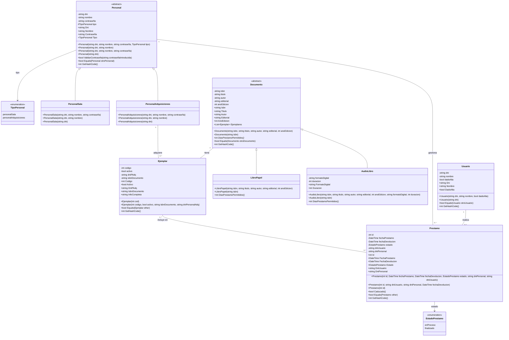

# Sistema de Gestión de Biblioteca

## Diagrama de Clases - Modelo de Dominio

```mermaid
classDiagram
    %% Enumeraciones
    class EstadoPrestamo {
        <<enumeration>>
        enProceso
        finalizado
    }
    
    class TipoPersonal {
        <<enumeration>>
        personalSala
        personalAdquisiciones
    }
    
    %% Clase Usuario
    class Usuario {
        -string dni
        -string nombre
        -bool dadoAlta
        +string Dni
        +string Nombre
        +bool DadoAlta
        +Usuario(string dni, string nombre, bool dadoAlta)
        +Usuario(string dni)
        +bool Equals(Usuario otroUsuario)
        +int GetHashCode()
    }
    
    %% Clase Personal (abstracta)
    class Personal {
        <<abstract>>
        -string dni
        -string nombre
        -string contraseña
        #TipoPersonal tipo
        +string Dni
        +string Nombre
        +string Contraseña
        +TipoPersonal Tipo
        +Personal(string dni, string nombre, string contraseña, TipoPersonal tipo)
        +Personal(string dni, string nombre)
        +Personal(string dni, string nombre, string contraseña)
        +Personal(string dni)
        +bool ValidarContraseña(string contraseñaIntroducida)
        +bool Equals(Personal otroPersonal)
        +int GetHashCode()
    }
    
    %% Clases derivadas de Personal
    class PersonalSala {
        +PersonalSala(string dni, string nombre, string contraseña)
        +PersonalSala(string dni, string nombre)
        +PersonalSala(string dni)
    }
    
    class PersonalAdquisiciones {
        +PersonalAdquisiciones(string dni, string nombre, string contraseña)
        +PersonalAdquisiciones(string dni, string nombre)
        +PersonalAdquisiciones(string dni)
    }
    
    %% Clase Prestamo
    class Prestamo {
        -int id
        -DateTime fechaPrestamo
        -DateTime fechaDevolucion
        -EstadoPrestamo estado
        -string dniUsuario
        -string dniPersonal
        +int Id
        +DateTime FechaPrestamo
        +DateTime FechaDevolucion
        +EstadoPrestamo Estado
        +string DniUsuario
        +string DniPersonal
        +Prestamo(int id, DateTime fechaPrestamo, DateTime fechaDevolucion, EstadoPrestamo estado, string dniPersonal, string dniUsuario)
        +Prestamo(int id, string dniUsuario, string dniPersonal, DateTime fechaDevolucion)
        +Prestamo(int id)
        +bool Caducado()
        +bool Equals(Prestamo other)
        +int GetHashCode()
    }
    
    %% Clase Documento (abstracta)
    class Documento {
        <<abstract>>
        -string isbn
        -string titulo
        -string autor
        -string editorial
        -int anoEdicion
        +string Isbn
        +string Titulo
        +string Autor
        +string Editorial
        +int AnoEdicion
        +List~Ejemplar~ Ejemplares
        +Documento(string isbn, string titulo, string autor, string editorial, int anoEdicion)
        +Documento(string isbn)
        +int DiasPrestamoPermitidos()*
        +bool Equals(Documento otroDocumento)
        +int GetHashCode()
    }
    
    %% Clases derivadas de Documento
    class LibroPapel {
        +LibroPapel(string isbn, string titulo, string autor, string editorial, int anoEdicion)
        +LibroPapel(string isbn)
        +int DiasPrestamoPermitidos()
    }
    
    class AudioLibro {
        -string formatoDigital
        -int duracion
        +string FormatoDigital
        +int Duracion
        +AudioLibro(string isbn, string titulo, string autor, string editorial, int anoEdicion, string formatoDigital, int duracion)
        +AudioLibro(string isbn)
        +int DiasPrestamoPermitidos()
    }
    
    %% Clase Ejemplar
    class Ejemplar {
        -int codigo
        -bool activo
        -string dniPAdq
        -string isbnDocumento
        +int Codigo
        +bool Activo
        +string DniPAdq
        +string IsbnDocumento
        +string InfoCompleta
        +Ejemplar(int cod)
        +Ejemplar(int codigo, bool activo, string isbnDocumento, string dniPersonalAdq)
        +bool Equals(Ejemplar other)
        +int GetHashCode()
    }
    
    %% Relaciones de Herencia
    Personal <|-- PersonalSala
    Personal <|-- PersonalAdquisiciones
    Documento <|-- LibroPapel
    Documento <|-- AudioLibro
    
    %% Asociaciones
    Personal --> TipoPersonal : tipo
    Prestamo --> EstadoPrestamo : estado
    Usuario "1" -- "0..*" Prestamo : realiza
    Personal "1" -- "0..*" Prestamo : gestiona
    Documento "1" -- "0..*" Ejemplar : tiene
    Ejemplar "1..*" -- "0..*" Prestamo : incluye en
    PersonalAdquisiciones "1" -- "0..*" Ejemplar : adquiere
```
